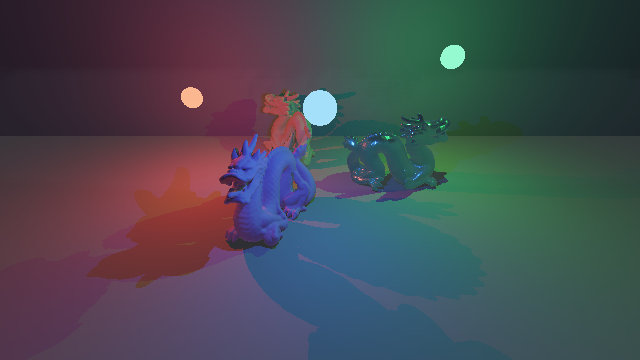

# Radia

Radia is a public, reproducible reference project for building a governed Rust
graphics application with [Agent Enhanced Projects
(AEP)](https://github.com/LairdWT/agent-enhanced-project). It is also a small
global-illumination renderer: a Vulkan-only WGPU program with a quaternion-first
deferred graph, WGSL shaders, a mesh-derived Stanford Chinese Dragon distance
field instanced as a three-dragon radial composition, three animated colored
emitters, occlusion shadows, and deterministic
screen-space indirect light.



The unusual constraint is deliberate: v1 constructs or uploads no transform or
projection matrices. Rigid poses are normalized dual quaternions and perspective
projection is evaluated analytically. The repository gate rejects Rust `Mat*`
types and WGSL `matNxM` types under project sources.

## OpenAI Build Week judge guide

Radia is the public, inspectable proof project for the **Agent Enhanced
Projects (AEPs)** Developer Tools submission. AEP is the submitted product;
Radia demonstrates what its rational guidance and mechanical enforcement can
produce in one governed project.

| Item | Link or value |
|---|---|
| Submitted project | [Agent Enhanced Projects (AEPs) on Devpost](https://devpost.com/software/agent-enhanced-projects-aeps) |
| Public narrated demo | [YouTube, 2 minutes 40 seconds](https://youtu.be/A5QJKrxsUS4) |
| AEP source | [LairdWT/agent-enhanced-project](https://github.com/LairdWT/agent-enhanced-project) (judge access is required while private) |
| Public proof source | [LairdWT/Radia](https://github.com/LairdWT/Radia) |
| Codex `/feedback` task | `019f75b8-db9b-77b3-87b3-d4870eb66651` |

The fastest **no-build review** is to watch the public demo, compare the
committed [`Off`](docs/evidence/separated-pbr-triad-rtx4070/radia-off.png) and
[`Radia`](docs/evidence/separated-pbr-triad-rtx4070/radia-on.png) frames, inspect
the human-readable [buffer views](docs/evidence/inspectable-buffers-rtx4070),
and read the machine-checked
[`controlled-delta-manifest.json`](docs/evidence/separated-pbr-triad-rtx4070/controlled-delta-manifest.json).
That path reviews the shipped behavior and its provenance without installing a
toolchain. It is artifact inspection, not a substitute for running the Vulkan
renderer; the complete build and test path is under [Run it](#run-it).

| Judging question | Evidence in this repository |
|---|---|
| Does it run and match the description? | [What is working](#what-is-working), [public demo](https://youtu.be/A5QJKrxsUS4), and [mechanical evidence](#mechanical-evidence) |
| How do I install and test it? | [Requirements and quickstart](#run-it) plus [verification commands](#verification) |
| Which platforms and sample data are supported? | [Requirements](#requirements) and [asset/license boundary](#license) |
| How were AEP, Codex, and GPT-5.6 used? | [Governed development record](#how-aep-codex-and-gpt-56-were-used) and the [dated build log](docs/hackathon/build-log.tsv) |
| What decisions shaped the result? | [Frozen contract](#frozen-math-and-rendering-contract) and [accepted ADR index](docs/adr/INDEX.md) |
| What was prior work versus new work? | [Prior work and new work](#prior-work-and-new-work) |

## What is working

- Rust 1.95, edition 2024, in a four-crate workspace.
- WGPU 26.0.1 and Winit 0.30.13, restricted to Vulkan on Windows and Linux.
- A rotating colored triangle transformed by a dual quaternion and projected
  analytically.
- A recognizable 871,306-triangle Stanford Chinese Dragon baked into a
  deterministic 128 cubed unsigned-distance field. Three normalized
  dual-quaternion instances keep their tail sides at one center, point their
  heads outward, and rotate slowly as one radial group.
- Distinct scene-linear cyan, magenta, and yellow GGX materials with roughness
  `0.2`, `0.65`, and `0.9`; cyan is metallic and the other two are dielectric.
- A 65-degree quaternion-only camera elevated to look down at the shared center
  by 30 degrees, with conservative pairwise field-bound separation.
- Three visible red, green, and blue emissive spheres with independent analytic
  orbit speeds, independent sine-wave vertical motion, bounded visibility
  traces, and colored occlusion shadows.
- A synthetic receiver floor and wall made from exact plane fields.
- Bounded sphere tracing with distinct hit, miss, and indeterminate results.
- `Off`, `Radia`, `GiOnly`, albedo, normal, bounded emissive, linear-depth,
  ambient-occlusion, SDF-distance, primitive-ID, step-count, trace-state, and
  triangle views.
- Hit-only production depth plus a conservative sampled-UDF domain extension:
  rotated storage bounds cannot become a dark indeterminate curtain.
- A deterministic 32-tap, spatially phased current-frame irradiance gather and
  fixed edge-aware resolve with no path tracing, per-frame random sampling,
  temporal history, convergence grain, or temporal ghosting.
- A fixed G-buffer, direct-lighting, indirect-gather, composite, and
  presentation graph with four G-buffer color targets plus reverse-Z
  `Depth32Float` depth.
- Linear `RGBA16Float` direct, indirect, and scene-radiance targets, one
  tone-map operation, and sRGB output.
- Guarded GGX/Smith/Schlick direct response plus deterministic unoccluded
  sky/ground environment fill; RADIA remains the separate geometry-derived
  indirect-light term.
- Analytic world-position reconstruction from depth and the camera dual
  quaternion; no inverse-view or projection matrix is created.
- Direct GPU readback, PNG capture, SHA-256 provenance, AEP visual manifests,
  and deterministic comparison reports.

The original analytic Build Week MVP remains in the history and evidence
archive. This upgrade deliberately exercises the next AEP math/graphics layer:
mesh ingestion, BVH distance baking, sampled-field error bounds, storage-buffer
layout, three-source visibility, and controlled direct-versus-indirect proof.
Clipmaps, a Surface Cache, radiance probes, and multi-bounce transport remain
post-MVP.

## Run it

### Requirements

- Windows 10/11 or Linux with a working Vulkan driver and Vulkan-capable GPU.
- Rust 1.95.0. `rust-toolchain.toml` makes rustup select it automatically.
- On Linux, the development packages required by your X11 or Wayland setup.
- No account, API key, network service, or external sample download is needed
  after cloning. The deterministic derived Dragon field is committed under
  `assets/stanford-dragon`; its separate Stanford license is described below.

The interactive renderer is supported on Windows and Linux only. It deliberately
requests WGPU's Vulkan backend, so macOS, browser, DX12, and Metal execution are
outside this reference project's v1 support boundary.

Clone and verify:

```text
git clone https://github.com/LairdWT/Radia.git
cd Radia
cargo test --workspace --all-features
cargo run --release -p radia-demo
```

The window starts in `Radia` mode on the jade dragon. Controls are:

- `Space`: cycle `Radia`, direct-only `Off`, `GiOnly`, albedo, normal,
  emissive, linear depth, ambient occlusion, SDF distance, primitive ID,
  step count, trace state, and the triangle baseline.
- `W`, `A`, `S`, `D`: move the camera in fixed 0.25 meter local increments.
- `Q`, `E`: move down or up in fixed 0.25 meter increments.
- `R`: restart the complete dragon-and-light scene motion at time zero.
- `Escape`: quit.

Radia selects the high-performance Vulkan adapter by default. To make a test
target explicit, set a unique adapter-name substring. Selection fails rather
than silently falling back when there is no unique compatible match.

```powershell
$env:RADIA_ADAPTER_NAME = 'NVIDIA'
cargo run --release -p radia-demo
```

```sh
RADIA_ADAPTER_NAME=AMD cargo run --release -p radia-demo
```

### Recommended live demo

Use this sequence for a quick technical walkthrough:

1. Launch `cargo run --release -p radia-demo`. Confirm the window title says
   `Radia - Jade Dragon Triad - mode Radia`. Identify the red, green, and blue
   sources.
   Watch their distinct horizontal orbit speeds and distinct sine-wave vertical
   motion around the three-dragon group.
2. Point out that all three silhouettes instance the same famous
   871,306-triangle Stanford scan through one deterministic 128 cubed
   mesh-derived field. Their tail sides meet at the center, their local `-Z`
   head directions point outward, and the conservatively disjoint 2.0 meter
   radial placement turns at `0.12` radians per second. Every pose is rebuilt
   analytically as a normalized dual
   quaternion; no matrix is constructed or uploaded.
3. Identify cyan/magenta/yellow in `Albedo`, then return to `Radia`: their
   roughness values are `0.2`, `0.65`, and `0.9`, with metallic `1.0` only on
   cyan. Direct response uses guarded GGX while a low-energy analytic sky/ground
   fill keeps unlit surfaces readable.
4. Press `Space` once for `Off`. Deterministic indirect color disappears while
   the three direct colors and the dragon's occlusion shadows remain.
5. Press `Space` for `GiOnly` to isolate the 32-tap screen-space irradiance.
   Continue through `Albedo`, `Normal`, `Emissive`, `LinearDepth`, and
   `AmbientOcclusion`. Depth is camera distance normalized by the 40 meter trace
   bound; AO is screen-space accessibility where black is occluded and white is
   open.
6. Continue through `SdfDistance`, `PrimitiveId`, `StepCount`, and `HitState`.
   Trace state uses blue for miss, green for hit, and magenta for indeterminate.
   The next mode is the triangle baseline; one more returns to `Radia`.
7. Press `W`, `A`, `S`, or `D` once to show fixed 0.25 meter camera movement.
   Press `R` to restart both the triad and all three light paths.
8. Open the committed
   [`Radia` capture](docs/evidence/separated-pbr-triad-rtx4070/radia-on.png)
   beside the
   [`Off` capture](docs/evidence/separated-pbr-triad-rtx4070/radia-off.png).
   The fixed triad comparison requires `4/255` and observes `50/255` peak
   delta across 3,846 subject-and-receiver ROI pixels.
9. Press `Escape` to close the demo.

For the Build Week recording, follow the timed
[`docs/hackathon/demo-script.md`](docs/hackathon/demo-script.md) sequence. Keep
the public video under three minutes and narrate what Radia proves, how AEP and
Codex governed the build, and how GPT-5.6 contributed to the skill stack.

### Headless capture

```powershell
cargo run -p radia-demo -- capture `
  --width 640 --height 360 --mode radia `
  --scene-time-seconds 10 `
  --dragon-angle-degrees 33 `
  --output Temp\captures\radia.png
```

Valid capture modes are `triangle`, `off`, `radia`, `gi`, `albedo`, `normal`,
`emissive`, `depth`, `ao`, `sdf`, `primitive`, `steps`, and `hit`.
`--scene-time-seconds` deterministically positions the triad and all three
lights; it defaults to zero. `--dragon-angle-degrees` optionally overrides only
the triad angle for exact rotation regressions.

Generate the controlled evidence pair:

```powershell
$env:RADIA_ADAPTER_NAME = 'NVIDIA'
cargo run -p radia-demo -- evidence `
  --width 640 --height 360 `
  --output-dir Temp\evidence\reproduction
```

## Frozen math and rendering contract

- Right-handed coordinates: `+X` right, `+Y` up, view forward `-Z`.
- Meters, radians, and active rotations.
- WGPU NDC depth `[0,1]`; reverse-Z maps near to 1 and infinite distance to 0.
- Framebuffer origin is top-left; pixel centers are `n + 0.5`.
- CPU quaternion semantics are `wxyz`; GPU adapters explicitly pack `xyzw`.
- A pose and its negation represent the same rigid transform.
- Three dragon poses are spaced by 120 degrees at a 2.0 meter origin radius.
  The baked local `-Z` head direction faces outward and local `+Z` faces the
  shared center. A metadata-derived separating-axis test proves more than 0.19
  meters of projected clearance between every pair of rigid field bounds.
- The default camera has a 65-degree vertical FOV and a normalized -30-degree
  active +X quaternion; local `-Z` targets the cluster center from above.
- Light positions are analytic functions of explicit seconds: independent
  angular orbits in the horizontal plane plus independent sinusoidal heights.
- Scale and shear are rejected at runtime. The dragon's scale and orientation
  are baked before its rigid dual-quaternion placement.
- Analytic SDF values are negative inside. The holed Stanford scan is instead a
  sampled unsigned-distance field; it makes no interior or exact-SDF claim.
- The dragon tracer subtracts the recorded half-cell-diagonal interpolation
  error before advancing. Thin features below the 128 cubed grid can disappear.
- Floating-point guards derive from `f32`, scene scale, and operation count;
  there is no project-wide epsilon.

The authoritative decisions live in [the accepted ADR
index](docs/adr/INDEX.md). The dual-quaternion derivation follows Kavan et al.,
[Skinning with Dual
Quaternions](https://users.cs.utah.edu/~ladislav/kavan07skinning/kavan07skinning.pdf),
while this project uses dual quaternions only for rigid poses in v1.

## Architecture

```text
radia-bake
  dependency-free OBJ parser, triangle BVH, deterministic UDF writer
      |
assets/stanford-dragon/dragon-128.rduf
      |
radia-demo
  window lifecycle, controls, capture CLI, evidence CLI
      |
radia-render
  Vulkan adapter/device/surface and fixed quaternion-first render graph
      |
  G-buffer -> 32-tap phased SSGI -> edge-aware composite -> presentation
      |
radia-math
  vectors, unit quaternions, unit dual quaternions, analytic projection
```

`radia-math` owns semantic CPU math and explicit GPU packing. `radia-render`
owns engine and shader conventions. This keeps WGPU layout, WGSL component
order, and clip-space behavior out of the language-neutral math layer.

The camera-to-world pose contains a unit real quaternion `r` and dual part
`d = 0.5 * t * r`. A point is rotated by `r * p * conjugate(r)` and translated
by `2 * vector(d * conjugate(r))`. Directions and normals use only `r`.
Perspective and screen rays are computed from field of view, aspect, near
distance, and pixel-center coordinates without constructing an inverse-view or
projection matrix.

The geometry pass traces the mesh-derived dragon plus analytic receiver planes
into albedo, normal/material, emissive, and trace G-buffer targets with
reverse-Z depth. The deferred pass reconstructs world position analytically
from depth and the camera dual quaternion. Every shaded point tests visibility
to all three colored sources, producing direct occlusion shadows. A separate
guarded GGX/Smith/Schlick BRDF gives the three dragons distinct roughness and
metalness response, based on [PBRT's microfacet
theory](https://www.pbr-book.org/4ed/Reflection_Models/Roughness_Using_Microfacet_Theory).
An analytic sky/ground term supplies bounded unoccluded environment fill; it is
not claimed as traced bounce. A separate
current-frame pass gathers direct radiance from thirty-two fixed antipodal,
radially stratified G-buffer locations. A fixed 4x4 spatial phase breaks
framebuffer-row coherence, and the existing composite stage applies a bounded
5x5 depth/normal-aware resolve. `Radia` composites that screen-space irradiance
over direct light; `GiOnly` isolates it. No secondary scene bounce, per-frame
random sample, previous frame, temporal average, or learned denoiser exists in
the current renderer.

The same fixed tap set stores screen-space ambient accessibility in indirect
alpha for the `AmbientOcclusion` view; it does not modulate production lighting.
Normalized debug values bypass radiance tone mapping. `LinearDepth` maps camera
distance over the declared trace interval into `[0,1]`; `AmbientOcclusion` uses
`0` for fully occluded and `1` for unoccluded. Only explicit trace-state and
step-count modes use a diagnostic depth sentinel to preserve non-hit telemetry.

## Mechanical evidence

The current RTX 4070 evidence fixes the camera, explicit scene time, three
head-outward dragon poses, field digest, all three animated-light positions,
direct equations, trace bounds, adapter, driver, resolution, GI method,
thirty-two tap offsets, 4x4 phase tile, and 5x5 resolve. Only `Off` versus
`Radia` changes.

| Check | Result |
|---|---:|
| Dragon field SHA-256 | `9a8babdacdab6dbc3b8789b5008bbbaee4c58c7ffea42183ada83397d5cb3862` |
| Colored light count | 3 |
| Subject and receiver ROI | `80,180` through `560,360` |
| Required peak delta | at least `4/255` |
| GI method | `screen-space-irradiance-v3`, 32 taps, 4x4 phase, 5x5 resolve |
| Observed peak delta | `50/255` |
| ROI pixels changed | 3,846 |
| Direct-only PNG SHA-256 | `3832fbdc6d2aee8c61cec67ebdee445d2c2d94e5519993e6114b8919e2f773f6` |
| Repeated RADIA PNG SHA-256 | `983ef738ef5f7729577fca16de908ca00e45636ebfabdf25c8be4cbc0adaef77` |
| Repeated fixed-state hashes match | true |

The current raw captures, three fixed-angle presentation frames, normalized
buffer views, adapter identity, hashes, settings, and manifests are in
[`docs/evidence/separated-pbr-triad-rtx4070`](docs/evidence/separated-pbr-triad-rtx4070).
The 33 degree regression capture, normalized buffer views, corrected AO/RADIA
captures at both evidence resolutions, and full-turn contact sheet are in
[`docs/evidence/inspectable-buffers-rtx4070`](docs/evidence/inspectable-buffers-rtx4070).
The original off-screen-emitter evidence remains unchanged under
[`docs/evidence/radia-mvp-rtx4070`](docs/evidence/radia-mvp-rtx4070) as the
historical analytic MVP proof; it is not a baseline for the mesh-derived scene.

Human inspection remains an owner judgment. The manifest proves controlled
state and numeric delta, not artistic quality. The ignored Vulkan suite passes
on both an NVIDIA GeForce RTX 4070 Laptop GPU and an AMD Radeon 610M.

## Verification

Run the same gates used in CI:

```text
cargo fmt --all -- --check
cargo clippy --workspace --all-targets --all-features -- -D warnings
cargo test --workspace --all-features
powershell -NoProfile -ExecutionPolicy Bypass -File scripts/check-matrix-ban.ps1
agent-code-skills adr check
agent-code-skills pins --check
agent-code-skills doctor
```

On POSIX systems, use `sh scripts/check-matrix-ban.sh` for the matrix gate.
The Vulkan readback test is intentionally ignored by the CPU-only default gate:

```powershell
$env:RADIA_ADAPTER_NAME = 'AMD'
cargo test -p radia-render --test vulkan_capture -- --ignored --nocapture
```

The AEP library is currently private. GitHub Actions always runs the Rust and
matrix gates; ADR and pin checks additionally run when the repository has an
`AEP_REPO_TOKEN` secret with read access to the pinned AEP commit. Without that
secret, CI emits a notice instead of pretending that cross-repository access
worked. The committed build log and fresh-clone rehearsal run those AEP checks
locally against the exact pinned library.

## How AEP, Codex, and GPT-5.6 were used

Radia began as a blank directory. AEP generated the repository contract,
runtime-specific agent surfaces, accepted-ADR workflow, version pins, hooks,
orchestration profiles, and GitHub gate. Only core routers are advertised at
startup; topic spokes are loaded per unit of work.

AEP addresses a recurring agent-development problem: prose instructions can be
forgotten, reinterpreted, or allowed to drift during a long build. Its
**rational layer** gives Codex focused skills, scoped agents, review doctrine,
and context-aware routing. Its **mechanical layer** turns owner decisions into
accepted ADRs, generated contracts, CLI checks, schemas, hooks, and evidence
gates. Radia therefore records both why a decision was made and an executable
way to detect important violations.

Codex was the agent workspace and tool interface used throughout the Build Week
session. GPT-5.6 Sol supplied the planning, coding, debugging, and review
reasoning inside that workflow. AEP constrained both with the same accepted
decisions and verification contracts. Together they:

1. refresh and prove the installed AEP library before project work;
2. scaffold the initial three-crate workspace, identify two routing gaps, and
   later add the dependency-free `radia-bake` tool under accepted ADRs;
3. freeze conventions, dependencies, lineage, MVP scope, and evidence policy;
4. derive and property-test the dual-quaternion and projection contracts;
5. implement and validate Rust, WGPU, and WGSL behavior on two Vulkan adapters;
6. diagnose visible tracing and banding defects from owner captures, amend the
   governing decisions, and prove the fixes with deterministic captures;
7. build the privacy-bounded OBS presentation controller and use a second
   AEP-governed local project for consented, isolated text-to-speech work; and
8. produce the public demo and reproducible, mechanically validated raw visual
   evidence without treating the compressed video as numeric proof.

Representative key decisions include normalized dual-quaternion rigid poses,
analytic matrix-free reverse-Z projection, Vulkan-only WGPU execution, a
deterministic current-frame deferred irradiance gather instead of path tracing,
separate Stanford asset licensing, and raw-capture evidence remaining
authoritative over presentation video. Those decisions and their rejected
alternatives are reviewable in [`docs/adr`](docs/adr/INDEX.md), not hidden in
chat history.

The AEP math, Rust, WGPU, WGSL, planning, Git, and operations skill bundles used
here were developed with Codex and GPT-5.6. Radia is their downstream stress
test: the project forced the skills to coordinate without loading the full
library into context. The dated unit-level record is in
[`docs/hackathon/build-log.tsv`](docs/hackathon/build-log.tsv), including the
primary Codex `/feedback` task ID.

## Prior work and new work

The OpenAI Build Week submission is the pre-existing **Agent Enhanced Projects
(AEPs)** developer tool. Its library, CLI, and earlier examples are prior work.
Radia is the new Build Week extension and was created from a blank directory on
July 18, 2026. Its dated Git history separates scaffold, accepted decisions,
math, renderer, and evidence work.

[SingularityEngine at commit
`15beff9`](https://github.com/LairdWT/SingularityEngine/commit/15beff9) was an
Apache-2.0 behavioral reference for a basic renderer lifecycle. No C++
architecture or matrix code was transliterated. A private earlier RADIA design
was consulted only as design evidence; no private code, assets, paths, or game
data are present in this repository.

This distinction follows the [Build Week official
rules](https://openai.devpost.com/rules), which evaluate pre-existing projects
only on work added during the submission period and require prior and new work
to be documented clearly.

## Hackathon handoff

Radia is evidence for the existing AEP Devpost project, not a separate
submission. The owner uploaded the narrated demo and submitted OpenAI Build
Week entry `1096888` on July 21, 2026 at 19:34:11 UTC. The live records are:

- [Devpost project](https://devpost.com/software/agent-enhanced-projects-aeps)
- [public YouTube demo](https://youtu.be/A5QJKrxsUS4)
- [AEP source repository](https://github.com/LairdWT/agent-enhanced-project)
- [public Radia proof repository](https://github.com/LairdWT/Radia)

The detailed owner-reviewed field record and receipt are in
[`docs/hackathon/devpost-update-draft.md`](docs/hackathon/devpost-update-draft.md).
The repository automation never uploads media, mutates Devpost, or submits an
entry; those remained explicit owner actions. The accepted public video is
under three minutes and its narration covers AEP, Codex, and GPT-5.6. The timed
recording source is in
[`docs/hackathon/demo-script.md`](docs/hackathon/demo-script.md).

### Repeatable OBS recording

The Build Week presentation uses OBS 30.2.3 or newer with OBS WebSocket 5,
PowerShell 7.4 or newer, and the committed 1080p30 timeline. Before using the
controller, enable WebSocket authentication in OBS and rotate any password
that existed before this workflow was installed. The password is requested as
a secure prompt; never put it in a command line, repository file, or log.

Run these commands from the repository root with OBS already open:

```powershell
pwsh -NoProfile -File scripts/record-devpost-demo.ps1 -Action Setup
pwsh -NoProfile -File scripts/record-devpost-demo.ps1 -Action Narration
pwsh -NoProfile -File scripts/record-devpost-demo.ps1 -Action DryRun -NarrationPath <take.wav>
pwsh -NoProfile -File scripts/record-devpost-demo.ps1 -Action Rehearse -NarrationPath <take.wav>
pwsh -NoProfile -File scripts/record-devpost-demo.ps1 -Action Record -NarrationPath <take.wav>
pwsh -NoProfile -File scripts/record-devpost-demo.ps1 -Action Validate -VideoPath <take.mp4>
```

An optional project-local synthetic narration workflow is available through
`C:\LocalTTS`. It keeps managed Python, PyTorch CUDA libraries, caches, and the
pinned Chatterbox model inside that directory; it does not install a system
Python or CUDA Toolkit. Review the exact script in
[`docs/hackathon/demo-script.md`](docs/hackathon/demo-script.md), then generate
one unpadded, independently replaceable WAV per section:

```powershell
C:\LocalTTS\.venv\Scripts\local-tts.exe synthesize-sections `
  C:\Radia\docs\hackathon\tts-narration.json `
  --output-dir C:\Radia\Temp\build-week-video\tts-review\section-take-01 `
  --reference-audio C:\LocalTTS\Temp\reference-voice\reference-a-128s.wav
```

Each WAV has a same-named editable `.txt` script. Add `--section <id>` to
generate only selected sections while preserving original seeds and ordinal
filenames. Pass `--scripts-dir <previous-take>` to synthesize hand-edited text
into a new empty take directory. The final owner-approved take is a composite
of the eight reviewed files, not a new single-pass synthesis. Its section
hashes and measured durations are frozen in
[`voice-selection.json`](docs/hackathon/voice-selection.json), and its local
assembly provenance records the exact offsets and output hash.

The selected 160-second composite is the only media input used by the final
OBS sequence:

```powershell
pwsh -NoProfile -File scripts/record-devpost-demo.ps1 -Action DryRun `
  -NarrationPath C:\Radia\Temp\build-week-video\final-narration-01\aep-radia-narration.wav
pwsh -NoProfile -File scripts/record-devpost-demo.ps1 -Action Rehearse `
  -NarrationPath C:\Radia\Temp\build-week-video\final-narration-01\aep-radia-narration.wav
pwsh -NoProfile -File scripts/record-devpost-demo.ps1 -Action Record `
  -NarrationPath C:\Radia\Temp\build-week-video\final-narration-01\aep-radia-narration.wav
```

The assembled mono PCM WAV is exactly 160 seconds, explicitly marked as
synthetic, and Chatterbox-watermarked. Owner approval of all eight source WAVs
is recorded separately from final video acceptance.

The owner selected review candidate 1. Full synthesis reuses that candidate's
underlying consented ten-second reference, `reference-a-128s.wav`, rather than
conditioning on the generated candidate WAV. LocalTTS was itself scaffolded
and governed with AEP: its decisions record consent and isolated dependencies,
its adapter bounds reference conditioning, and its tests and provenance gate
the output. The demo names this voice work as a second AEP proof alongside
Radia. [`voice-selection.json`](docs/hackathon/voice-selection.json) records the
selected hashes, settings, timing basis, and still-closed approval gates without
publishing the source voice recording or a private path.

`Setup` provisions only the `Radia Build Week` profile and collection. It
refuses unexpected objects with reserved names, never edits or deletes the
existing `Untitled` configuration, uses window and local browser sources only,
and restores the previously active profile and collection. The final mix mutes
desktop audio and uses only the selected narration take. Recording is MKV for
crash recovery, followed by automatic MP4 remux.

The automated sequence is Renderer, AEP Proof, Math Proof, Renderer, Buffer
Modes (`Off`, `GiOnly`, `Albedo`, `Normal`, `Emissive`, `LinearDepth`, and
`AmbientOcclusion`), Evidence, Closing, and a final uninterrupted Renderer
shot. The controller talks to `radia-demo` through acknowledged stdin commands;
it does not inject keyboard or mouse input. The public proof deck is
[`docs/hackathon/video-deck.html`](docs/hackathon/video-deck.html), and the
machine-validated schedule is
[`docs/hackathon/video-timeline.json`](docs/hackathon/video-timeline.json).

If rehearsal or recording aborts, keep the MKV, read the reported failed cue,
confirm OBS WebSocket is authenticated, confirm the Radia window is visible,
and run `DryRun` again before retrying. An aborted take does not overwrite an
earlier take. `Record` writes hashes, versions, adapter identity, timing, OBS
statistics, and reproduction command beneath `Temp/build-week-video/`.

The submitted take passed owner review for intelligible audio, readable buffer
labels, privacy-safe cards, an artifact-free final shot, and a duration below
three minutes. Any replacement take must pass those gates again before the
owner changes YouTube or Devpost. The controller never uploads, mutates
Devpost, or substitutes compressed video for the authoritative raw GPU
evidence.

## License

Radia's code is Apache-2.0; see [LICENSE](LICENSE). The derived Stanford Dragon
field is separately governed by the Stanford Scan terms and is not approved for
commercial use without Stanford's permission. Its hashes, attribution,
reproduction command, cultural-use note, and authoritative terms are in
[`assets/stanford-dragon/README.md`](assets/stanford-dragon/README.md).

## Primary technical references

- [Kavan et al., Skinning with Dual Quaternions](https://users.cs.utah.edu/~ladislav/kavan07skinning/kavan07skinning.pdf)
- [Hart, Sphere Tracing](https://experts.illinois.edu/en/publications/sphere-tracing-a-geometric-method-for-the-antialiased-ray-tracing/)
- [PBRT v4, Sampling and Reconstruction](https://www.pbr-book.org/4ed/Sampling_and_Reconstruction)
- [WGPU 26.0.1 API](https://docs.rs/wgpu/26.0.1/wgpu/)
- [WebGPU Shading Language](https://www.w3.org/TR/WGSL/)
- [Stanford 3D Scanning Repository](https://graphics.stanford.edu/data/3Dscanrep/)
- [Morgan McGuire Computer Graphics Archive](https://casual-effects.com/data)
