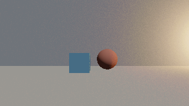

# Radia

Radia is a public, reproducible reference project for building a governed Rust
graphics application with [Agent Enhanced Projects
(AEP)](https://github.com/LairdWT/agent-enhanced-project). It is also a small
global-illumination renderer: a Vulkan-only WGPU program with WGSL shaders,
analytic signed-distance geometry, and one emissive indirect bounce.



The unusual constraint is deliberate: v1 constructs or uploads no transform or
projection matrices. Rigid poses are normalized dual quaternions and perspective
projection is evaluated analytically. The repository gate rejects Rust `Mat*`
types and WGSL `matNxM` types under project sources.

## What is working

- Rust 1.95, edition 2024, in a three-crate workspace.
- WGPU 26.0.1 and Winit 0.30.13, restricted to Vulkan on Windows and Linux.
- A rotating colored triangle transformed by a dual quaternion and projected
  analytically.
- A synthetic courtyard made from exact sphere, box, and plane fields.
- Bounded sphere tracing with distinct hit, miss, and indeterminate results.
- `Off`, `Radia`, `GiOnly`, SDF distance, primitive ID, normal, step-count, and
  trace-state views.
- A deterministic, versioned Hammersley sequence and one cosine-weighted
  emissive bounce.
- Ping-pong `RGBA16Float` temporal accumulation, one tone-map operation, and
  sRGB output.
- Direct GPU readback, PNG capture, SHA-256 provenance, AEP visual manifests,
  and deterministic comparison reports.

This is the Build Week MVP. Mesh SDF baking, clipmaps, a Surface Cache, radiance
probes, and bounded multi-bounce transport are intentionally post-MVP.

## Run it

### Requirements

- Windows 10/11 or Linux with a working Vulkan driver and Vulkan-capable GPU.
- Rust 1.95.0. `rust-toolchain.toml` makes rustup select it automatically.
- On Linux, the development packages required by your X11 or Wayland setup.

Clone and verify:

```text
git clone https://github.com/LairdWT/Radia.git
cd Radia
cargo test --workspace --all-features
cargo run --release -p radia-demo
```

The window starts with the rotating triangle baseline. Controls are:

- `Space`: cycle triangle, direct-only, RADIA, GI-only, and debug views.
- `W`, `A`, `S`, `D`: move the camera in fixed 0.25 meter local increments.
- `Q`, `E`: move down or up in fixed 0.25 meter increments.
- `R`: reset temporal history.
- `Escape`: quit.

Radia selects the high-performance Vulkan adapter by default. To make a test
target explicit, set a unique adapter-name substring. Selection fails rather
than silently falling back when there is no unique compatible match.

```powershell
$env:RADIA_ADAPTER_NAME = 'NVIDIA'
cargo run --release -p radia-demo
```

```sh
RADIA_ADAPTER_NAME=AMD cargo run --release -p radia-demo
```

### Headless capture

```powershell
cargo run -p radia-demo -- capture `
  --width 640 --height 360 --samples 256 --mode radia `
  --output Temp\captures\radia.png
```

Valid capture modes are `triangle`, `off`, `radia`, `gi`, `sdf`, `primitive`,
`normal`, `steps`, and `hit`.

Generate the controlled evidence pair:

```powershell
$env:RADIA_ADAPTER_NAME = 'NVIDIA'
cargo run -p radia-demo -- evidence `
  --width 320 --height 180 --samples 1024 `
  --output-dir Temp\evidence\reproduction
```

## Frozen math and rendering contract

- Right-handed coordinates: `+X` right, `+Y` up, view forward `-Z`.
- Meters, radians, and active rotations.
- WGPU NDC depth `[0,1]`; reverse-Z maps near to 1 and infinite distance to 0.
- Framebuffer origin is top-left; pixel centers are `n + 0.5`.
- CPU quaternion semantics are `wxyz`; GPU adapters explicitly pack `xyzw`.
- A pose and its negation represent the same rigid transform.
- Scale and shear are rejected. Asset scale will be baked into vertices.
- SDF values are negative inside. Rigid inverse transforms preserve distance.
- Floating-point guards derive from `f32`, scene scale, and operation count;
  there is no project-wide epsilon.

The authoritative decisions live in [the accepted ADR
index](docs/adr/INDEX.md). The dual-quaternion derivation follows Kavan et al.,
[Skinning with Dual
Quaternions](https://users.cs.utah.edu/~ladislav/kavan07skinning/kavan07skinning.pdf),
while this project uses dual quaternions only for rigid poses in v1.

## Architecture

```text
radia-demo
  window lifecycle, controls, capture CLI, evidence CLI
      |
radia-render
  Vulkan adapter/device/surface, WGSL pipelines, SDF, RADIA, readback
      |
radia-math
  vectors, unit quaternions, unit dual quaternions, analytic projection
```

`radia-math` owns semantic CPU math and explicit GPU packing. `radia-render`
owns engine and shader conventions. This keeps WGPU layout, WGSL component
order, and clip-space behavior out of the language-neutral math layer.

The camera-to-world pose contains a unit real quaternion `r` and dual part
`d = 0.5 * t * r`. A point is rotated by `r * p * conjugate(r)` and translated
by `2 * vector(d * conjugate(r))`. Directions and normals use only `r`.
Perspective and screen rays are computed from field of view, aspect, near
distance, and pixel-center coordinates without constructing an inverse-view or
projection matrix.

The renderer traces the analytic courtyard, evaluates fixed direct lighting,
and optionally sends one deterministic cosine-weighted ray toward the scene.
Only an emissive SDF hit contributes the indirect term. History is reset when
camera, scene, mode, or emitter state changes.

## Mechanical evidence

The committed RTX 4070 evidence was captured twice at revision
`25278ed1a5e0a18161d635fcfdd5ba90c0487f4f`.

| Check | Result |
|---|---:|
| Emitter analytically outside the camera frustum | true |
| Receiver ROI | `40,90` through `280,180` |
| Required peak delta | at least `4/255` |
| Observed peak delta | `100/255` |
| Receiver pixels changed | 8,653 |
| Repeated RADIA PNG SHA-256 | `889628a04fa663f200d79bdc06a70ce36ab1fd53dab551f99266df71eac40442` |
| Repeated decoded differences | 0 |

The test keeps receiver albedo, direct lighting, geometry, camera, depth
contract, emitter, and sample sequence fixed; only the indirect producer mode
changes. Raw captures, adapter identity, hashes, settings, AEP manifests,
characterization, differences, and contact sheets are in
[`docs/evidence/radia-mvp-rtx4070`](docs/evidence/radia-mvp-rtx4070).

The ignored Vulkan suite passed on both an NVIDIA GeForce RTX 4070 Laptop GPU
and an AMD Radeon 610M. Human inspection is useful for diagnosis, but the
committed comparison reports are the acceptance evidence.

## Verification

Run the same gates used in CI:

```text
cargo fmt --all -- --check
cargo clippy --workspace --all-targets --all-features -- -D warnings
cargo test --workspace --all-features
powershell -NoProfile -ExecutionPolicy Bypass -File scripts/check-matrix-ban.ps1
agent-code-skills adr check
agent-code-skills pins --check
agent-code-skills doctor
```

On POSIX systems, use `sh scripts/check-matrix-ban.sh` for the matrix gate.
The Vulkan readback test is intentionally ignored by the CPU-only default gate:

```powershell
$env:RADIA_ADAPTER_NAME = 'AMD'
cargo test -p radia-render --test vulkan_capture -- --ignored --nocapture
```

## How AEP and Codex were used

Radia began as a blank directory. AEP generated the repository contract,
runtime-specific agent surfaces, accepted-ADR workflow, version pins, hooks,
orchestration profiles, and GitHub gate. Only core routers are advertised at
startup; topic spokes are loaded per unit of work.

Codex then used those governed surfaces to:

1. refresh and prove the installed AEP library before project work;
2. scaffold the three-crate workspace and identify two routing gaps;
3. freeze conventions, dependencies, lineage, MVP scope, and evidence policy;
4. derive and property-test the dual-quaternion and projection contracts;
5. implement and validate WGPU/WGSL behavior on two Vulkan adapters; and
6. produce reproducible, mechanically validated visual evidence.

The AEP math, Rust, WGPU, WGSL, planning, Git, and operations skill bundles used
here were developed with Codex and GPT-5.6. Radia is their downstream stress
test: the project forced the skills to coordinate without loading the full
library into context. The dated unit-level record is in
[`docs/hackathon/build-log.tsv`](docs/hackathon/build-log.tsv), including the
primary Codex `/feedback` task ID.

## Prior work and new work

The OpenAI Build Week submission is the pre-existing **Agent Enhanced Projects
(AEPs)** developer tool. Its library, CLI, and earlier examples are prior work.
Radia is the new Build Week extension and was created from a blank directory on
July 18, 2026. Its dated Git history separates scaffold, accepted decisions,
math, renderer, and evidence work.

[SingularityEngine at commit
`15beff9`](https://github.com/LairdWT/SingularityEngine/commit/15beff9) was an
Apache-2.0 behavioral reference for a basic renderer lifecycle. No C++
architecture or matrix code was transliterated. A private earlier RADIA design
was consulted only as design evidence; no private code, assets, paths, or game
data are present in this repository.

This distinction follows the [Build Week official
rules](https://openai.devpost.com/rules), which evaluate pre-existing projects
only on work added during the submission period and require prior and new work
to be documented clearly.

## Hackathon handoff

Radia is evidence for the existing AEP Devpost project, not a separate
submission. The owner-review draft and required-field checklist are in
[`docs/hackathon/devpost-update-draft.md`](docs/hackathon/devpost-update-draft.md).
Nothing in this repository updates or submits Devpost automatically.

The live deadline is July 21, 2026 at 5:00 PM Pacific Time, which is July 22 at
00:00 UTC. The required public YouTube demo must be under three minutes and
include audio covering the project, Codex, and GPT-5.6. A timed recording plan
is in [`docs/hackathon/demo-script.md`](docs/hackathon/demo-script.md).

## License

Apache-2.0. See [LICENSE](LICENSE).

## Primary technical references

- [Kavan et al., Skinning with Dual Quaternions](https://users.cs.utah.edu/~ladislav/kavan07skinning/kavan07skinning.pdf)
- [Hart, Sphere Tracing](https://experts.illinois.edu/en/publications/sphere-tracing-a-geometric-method-for-the-antialiased-ray-tracing/)
- [PBRT v4, Sampling and Reconstruction](https://www.pbr-book.org/4ed/Sampling_and_Reconstruction)
- [WGPU 26.0.1 API](https://docs.rs/wgpu/26.0.1/wgpu/)
- [WebGPU Shading Language](https://www.w3.org/TR/WGSL/)
